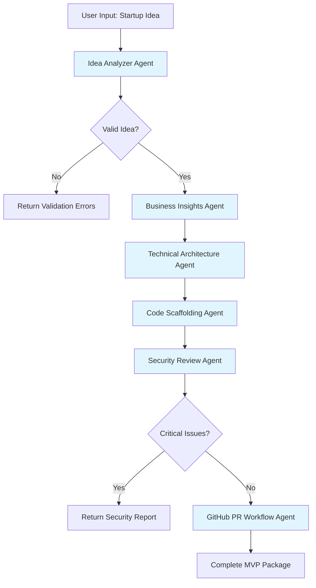
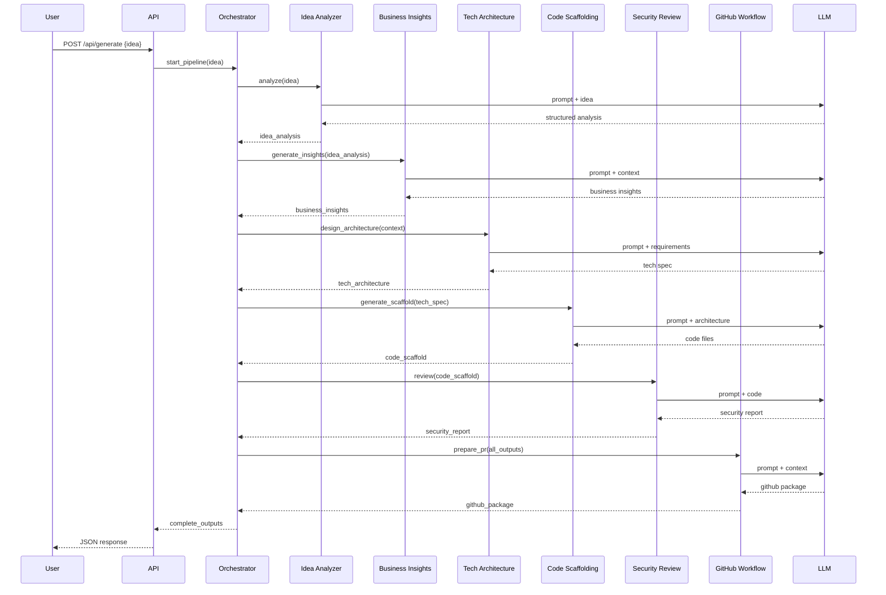

# AI Venture Studio - Lightweight Architecture Design

## System Overview

A hackathon MVP that transforms startup ideas into production-ready code through a sequential agent pipeline. Optimized for speed, simplicity, and minimal token usage.

---

## Core Agents & Responsibilities

### 1. **Idea Analyzer Agent**
**Purpose**: Parse and validate startup idea input
**Responsibilities**:
- Extract key components: problem, solution, target market, unique value proposition
- Validate idea completeness (missing critical elements)
- Generate structured idea summary
- Estimate complexity score (1-10)

**Input**: Raw text description of startup idea
**Output**: Structured JSON with validated idea components

**Token Budget**: ~500-1000 tokens

---

### 2. **Business Insights Agent**
**Purpose**: Generate business strategy and market analysis
**Responsibilities**:
- Identify target customer segments
- Analyze competitive landscape (3-5 competitors)
- Suggest revenue models
- Outline go-to-market strategy
- Identify key risks and mitigation strategies

**Input**: Structured idea from Idea Analyzer
**Output**: Business canvas with market insights

**Token Budget**: ~1500-2000 tokens

---

### 3. **Technical Architecture Agent**
**Purpose**: Design system architecture and tech stack
**Responsibilities**:
- Recommend tech stack based on idea requirements
- Design system architecture (microservices, monolith, serverless)
- Define data models and database schema
- Identify third-party integrations needed
- Create component diagram

**Input**: Idea summary + business requirements
**Output**: Technical specification document with architecture diagram

**Token Budget**: ~2000-3000 tokens

---

### 4. **Code Scaffolding Agent**
**Purpose**: Generate MVP boilerplate code
**Responsibilities**:
- Generate project structure
- Create backend API endpoints (FastAPI)
- Generate frontend components (React)
- Set up database models
- Create Docker configuration
- Generate README with setup instructions

**Input**: Technical architecture specification
**Output**: Complete project scaffold (file tree + code files)

**Token Budget**: ~4000-6000 tokens (largest agent)

---

### 5. **Security Review Agent**
**Purpose**: Identify security vulnerabilities and best practices
**Responsibilities**:
- Check for common security issues (SQL injection, XSS, CSRF)
- Validate authentication/authorization patterns
- Review API security (rate limiting, input validation)
- Check for exposed secrets or credentials
- Suggest security improvements

**Input**: Generated code files
**Output**: Security audit report with severity ratings

**Token Budget**: ~1000-1500 tokens

---

### 6. **GitHub PR Workflow Agent**
**Purpose**: Prepare code for GitHub integration
**Responsibilities**:
- Generate comprehensive PR description
- Create CHANGELOG.md
- Generate commit messages
- Create GitHub Actions workflow for CI/CD
- Generate issue templates
- Create project documentation

**Input**: All previous outputs + generated code
**Output**: GitHub-ready package with PR template

**Token Budget**: ~800-1200 tokens

---

## Execution Flow



---

## Orchestration Sequence

### Sequential Pipeline Pattern (Simplest for Hackathon)

```python
# Pseudo-code for orchestration
async def generate_venture_studio_mvp(idea: str):
    # Step 1: Analyze idea
    idea_analysis = await idea_analyzer.analyze(idea)
    if not idea_analysis.is_valid:
        return {"error": idea_analysis.validation_errors}
    
    # Step 2: Generate business insights
    business_insights = await business_agent.generate_insights(idea_analysis)
    
    # Step 3: Design technical architecture
    tech_architecture = await tech_agent.design_architecture(
        idea_analysis, 
        business_insights
    )
    
    # Step 4: Generate code scaffold
    code_scaffold = await code_agent.generate_scaffold(tech_architecture)
    
    # Step 5: Run security review
    security_report = await security_agent.review(code_scaffold)
    if security_report.has_critical_issues:
        return {"error": "Critical security issues found", "report": security_report}
    
    # Step 6: Prepare GitHub PR
    github_package = await github_agent.prepare_pr(
        idea_analysis,
        business_insights,
        tech_architecture,
        code_scaffold,
        security_report
    )
    
    return {
        "status": "success",
        "outputs": {
            "idea": idea_analysis,
            "business": business_insights,
            "architecture": tech_architecture,
            "code": code_scaffold,
            "security": security_report,
            "github": github_package
        }
    }
```

### Key Design Decisions:
1. **Sequential over Parallel**: Simpler to debug, each agent depends on previous output
2. **Fail-Fast**: Stop pipeline on critical errors (invalid idea, security issues)
3. **Stateless Agents**: Each agent is independent, no shared state
4. **JSON Communication**: All inter-agent communication via structured JSON

---

## Recommended Folder Structure

```
ai-venture-studio/
├── backend/
│   ├── agents/
│   │   ├── __init__.py
│   │   ├── base_agent.py              # Abstract base class for all agents
│   │   ├── idea_analyzer.py           # Agent 1
│   │   ├── business_insights.py       # Agent 2
│   │   ├── technical_architecture.py  # Agent 3
│   │   ├── code_scaffolding.py        # Agent 4
│   │   ├── security_review.py         # Agent 5
│   │   └── github_workflow.py         # Agent 6
│   ├── orchestrator/
│   │   ├── __init__.py
│   │   ├── pipeline.py                # Main orchestration logic
│   │   └── state_manager.py           # Track pipeline state
│   ├── models/
│   │   ├── __init__.py
│   │   ├── idea.py                    # Pydantic models for idea
│   │   ├── business.py                # Business insights models
│   │   ├── architecture.py            # Tech architecture models
│   │   └── outputs.py                 # Output schemas
│   ├── api/
│   │   ├── __init__.py
│   │   ├── main.py                    # FastAPI app
│   │   ├── routes.py                  # API endpoints
│   │   └── websockets.py              # Optional: real-time updates
│   ├── utils/
│   │   ├── __init__.py
│   │   ├── llm_client.py              # LLM provider wrapper
│   │   ├── prompts.py                 # Prompt templates
│   │   └── validators.py              # Input validation
│   ├── config/
│   │   ├── __init__.py
│   │   └── settings.py                # Environment config
│   ├── tests/
│   │   ├── test_agents.py
│   │   └── test_orchestrator.py
│   ├── requirements.txt
│   └── Dockerfile
│
├── frontend/
│   ├── public/
│   ├── src/
│   │   ├── components/
│   │   │   ├── IdeaInput.tsx          # Startup idea form
│   │   │   ├── PipelineProgress.tsx   # Progress indicator
│   │   │   ├── ResultsViewer.tsx      # Display all outputs
│   │   │   └── CodePreview.tsx        # Syntax-highlighted code
│   │   ├── pages/
│   │   │   ├── Home.tsx
│   │   │   └── Results.tsx
│   │   ├── services/
│   │   │   └── api.ts                 # Backend API client
│   │   ├── types/
│   │   │   └── index.ts               # TypeScript interfaces
│   │   ├── App.tsx
│   │   └── main.tsx
│   ├── package.json
│   ├── vite.config.ts
│   └── Dockerfile
│
├── docker-compose.yml                  # Full stack orchestration
├── .env.example
├── README.md
└── ARCHITECTURE.md                     # This file
```

---

## API Contracts

### POST `/api/generate`
**Request**:
```json
{
  "idea": "A platform that connects freelance developers with startups...",
  "options": {
    "include_tests": false,
    "tech_stack_preference": "python",
    "deployment_target": "docker"
  }
}
```

**Response** (Success):
```json
{
  "status": "success",
  "job_id": "uuid-here",
  "outputs": {
    "idea_analysis": {...},
    "business_insights": {...},
    "technical_architecture": {...},
    "code_scaffold": {...},
    "security_report": {...},
    "github_package": {...}
  },
  "metadata": {
    "total_tokens_used": 12500,
    "execution_time_seconds": 45,
    "timestamp": "2026-05-16T13:45:00Z"
  }
}
```

**Response** (Error):
```json
{
  "status": "error",
  "error": {
    "stage": "security_review",
    "message": "Critical security vulnerabilities detected",
    "details": {...}
  }
}
```

### GET `/api/status/{job_id}`
Track pipeline progress (optional for async processing)

### WebSocket `/ws/generate`
Real-time streaming of agent outputs (optional enhancement)

---

## Data Flow



---

## Agent Interface Design

### Base Agent Class
```python
from abc import ABC, abstractmethod
from typing import Any, Dict

class BaseAgent(ABC):
    def __init__(self, llm_client, config: Dict[str, Any]):
        self.llm = llm_client
        self.config = config
        self.name = self.__class__.__name__
    
    @abstractmethod
    async def execute(self, input_data: Dict[str, Any]) -> Dict[str, Any]:
        """Main execution method - must be implemented by each agent"""
        pass
    
    @abstractmethod
    def get_prompt(self, input_data: Dict[str, Any]) -> str:
        """Generate LLM prompt based on input"""
        pass
    
    def validate_input(self, input_data: Dict[str, Any]) -> bool:
        """Validate input data structure"""
        return True
    
    def parse_output(self, llm_response: str) -> Dict[str, Any]:
        """Parse LLM response into structured format"""
        return {"raw": llm_response}
```

---

## Token Optimization Strategies

### 1. **Prompt Engineering**
- Use concise, structured prompts
- Provide clear output format requirements (JSON schema)
- Limit examples to 1-2 per prompt

### 2. **Context Management**
- Only pass relevant context to each agent
- Summarize previous outputs before passing to next agent
- Use token counting to stay within limits

### 3. **Output Constraints**
- Specify max length for each agent output
- Request bullet points over paragraphs
- Use abbreviations in internal communication

### 4. **Caching Strategy**
- Cache common prompt templates
- Reuse LLM responses for similar ideas (optional)
- Store intermediate results to avoid re-computation

### 5. **Model Selection**
- Use GPT-4o-mini or Claude Haiku for simple tasks (Agents 1, 5, 6)
- Reserve GPT-4 or Claude Sonnet for complex tasks (Agents 3, 4)

**Estimated Total Token Usage per Run**: 10,000-15,000 tokens

---

## Technology Stack Recommendations

### Backend
- **Framework**: FastAPI (async support, auto-docs, fast)
- **LLM Client**: `openai` or `anthropic` SDK
- **Validation**: Pydantic v2 (type safety, JSON schema)
- **Task Queue**: None (sequential is fine for hackathon)
- **Database**: SQLite or PostgreSQL (store job history)

### Frontend
- **Framework**: React 18 + Vite (fast dev server)
- **UI Library**: Tailwind CSS + shadcn/ui (rapid prototyping)
- **State Management**: Zustand or React Context (lightweight)
- **Code Display**: react-syntax-highlighter
- **HTTP Client**: Axios or fetch

### DevOps
- **Containerization**: Docker + docker-compose
- **Environment**: python-dotenv for config
- **Testing**: pytest (backend), Vitest (frontend)

---

## Deployment Considerations

### Local Development
```bash
# Start backend
cd backend && uvicorn api.main:app --reload

# Start frontend
cd frontend && npm run dev
```

### Docker Deployment
```bash
docker-compose up --build
```

### Cloud Deployment Options
1. **Vercel** (frontend) + **Railway** (backend) - Easiest
2. **Render** (full stack) - Simple, free tier
3. **AWS ECS** or **Google Cloud Run** - Production-ready

---

## Error Handling Strategy

### Agent-Level Errors
- Retry logic: 2 attempts with exponential backoff
- Fallback: Return partial results with error flag
- Logging: Capture all LLM interactions for debugging

### Pipeline-Level Errors
- Fail-fast on critical errors (invalid idea, security issues)
- Continue on warnings (minor security issues, incomplete data)
- Return detailed error context to user

### User-Facing Errors
```json
{
  "status": "error",
  "stage": "code_scaffolding",
  "message": "Failed to generate complete code scaffold",
  "user_message": "We encountered an issue generating your code. Please try simplifying your idea or contact support.",
  "retry_possible": true
}
```

---

## Performance Targets (Hackathon MVP)

- **End-to-End Latency**: < 60 seconds
- **Agent Execution Time**: 5-15 seconds each
- **API Response Time**: < 100ms (excluding LLM calls)
- **Token Usage**: < 15,000 tokens per run
- **Concurrent Users**: 10-20 (hackathon demo)

---

## Future Enhancements (Post-Hackathon)

1. **Parallel Agent Execution**: Run independent agents concurrently
2. **Streaming Responses**: WebSocket for real-time progress updates
3. **Agent Feedback Loop**: Allow agents to request clarification
4. **Multi-Model Support**: Switch between OpenAI, Anthropic, local models
5. **Code Execution**: Sandbox environment to test generated code
6. **Version Control**: Track iterations and allow rollback
7. **Collaboration**: Multi-user support with shared projects
8. **Templates**: Pre-built templates for common startup types

---

## Success Metrics

### Technical Metrics
- Pipeline success rate > 90%
- Average token usage < 15,000
- End-to-end latency < 60s
- Zero critical security vulnerabilities in generated code

### User Metrics
- Idea-to-code time < 2 minutes
- User satisfaction score > 4/5
- Code quality score > 7/10 (manual review)

---

## Risk Mitigation

| Risk | Impact | Mitigation |
|------|--------|------------|
| LLM API rate limits | High | Implement exponential backoff, use multiple API keys |
| Token budget exceeded | Medium | Strict prompt engineering, output length limits |
| Generated code doesn't run | High | Add validation step, include setup instructions |
| Security vulnerabilities | Critical | Mandatory security review, fail on critical issues |
| Poor idea quality | Low | Validate idea completeness, provide examples |

---

## Development Timeline (Hackathon)

### Day 1 (8 hours)
- Set up project structure
- Implement base agent class
- Build Idea Analyzer + Business Insights agents
- Create basic FastAPI endpoints

### Day 2 (8 hours)
- Implement Technical Architecture agent
- Build Code Scaffolding agent (most complex)
- Create orchestration pipeline
- Basic frontend UI

### Day 3 (8 hours)
- Implement Security Review agent
- Build GitHub Workflow agent
- Frontend polish + integration
- Testing + bug fixes

### Day 4 (4 hours)
- Documentation
- Demo preparation
- Final testing
- Deployment

---

## Conclusion

This architecture prioritizes:
✅ **Simplicity**: Sequential pipeline, stateless agents
✅ **Speed**: Minimal token usage, fast execution
✅ **Modularity**: Independent agents, easy to extend
✅ **Hackathon-Friendly**: Can be built in 3-4 days
✅ **Production-Ready**: Clear path to scale post-hackathon

The design balances sophistication with pragmatism, ensuring you can deliver a working MVP within hackathon constraints while maintaining code quality and extensibility.